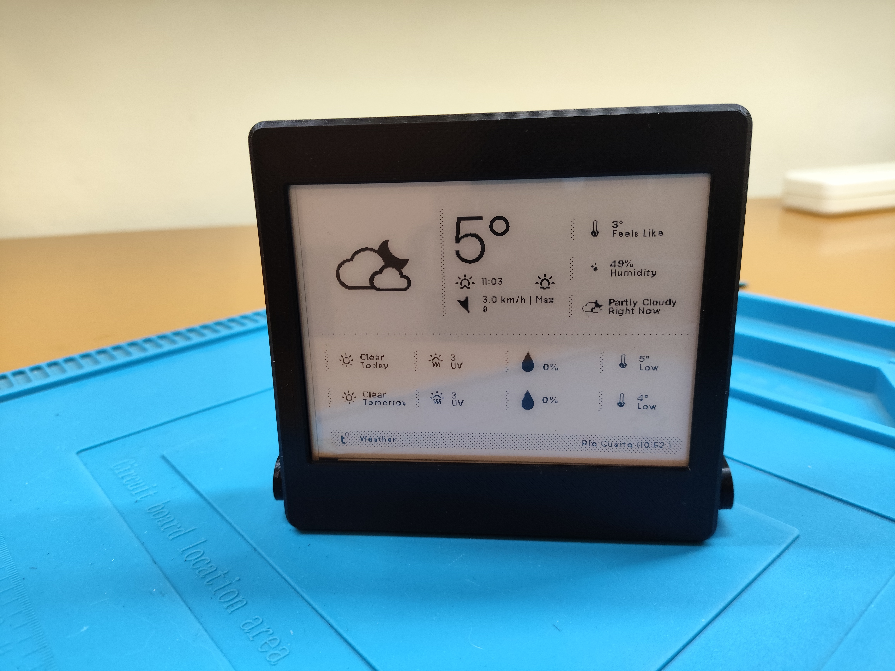
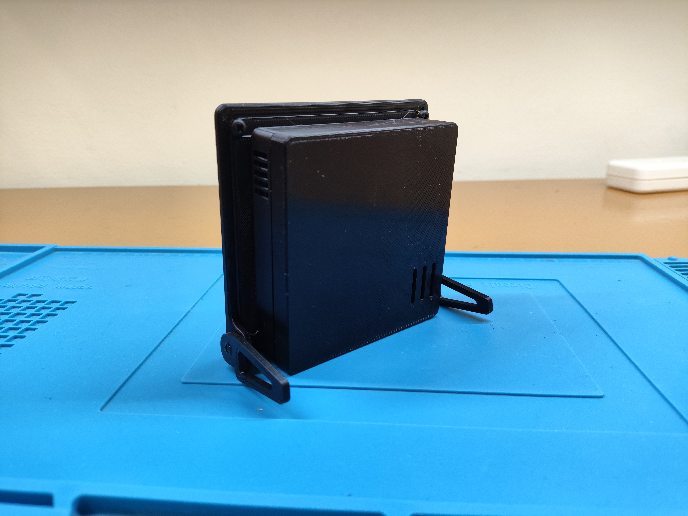
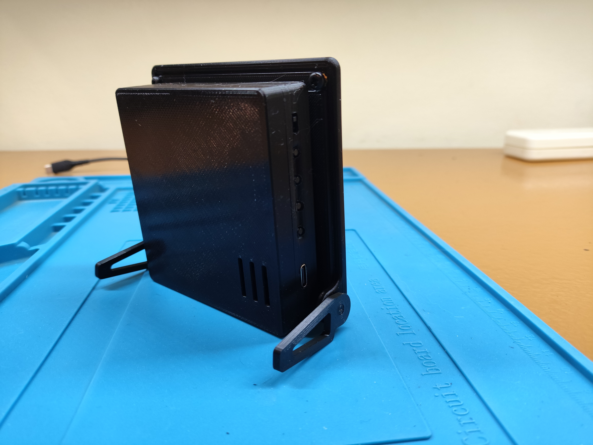
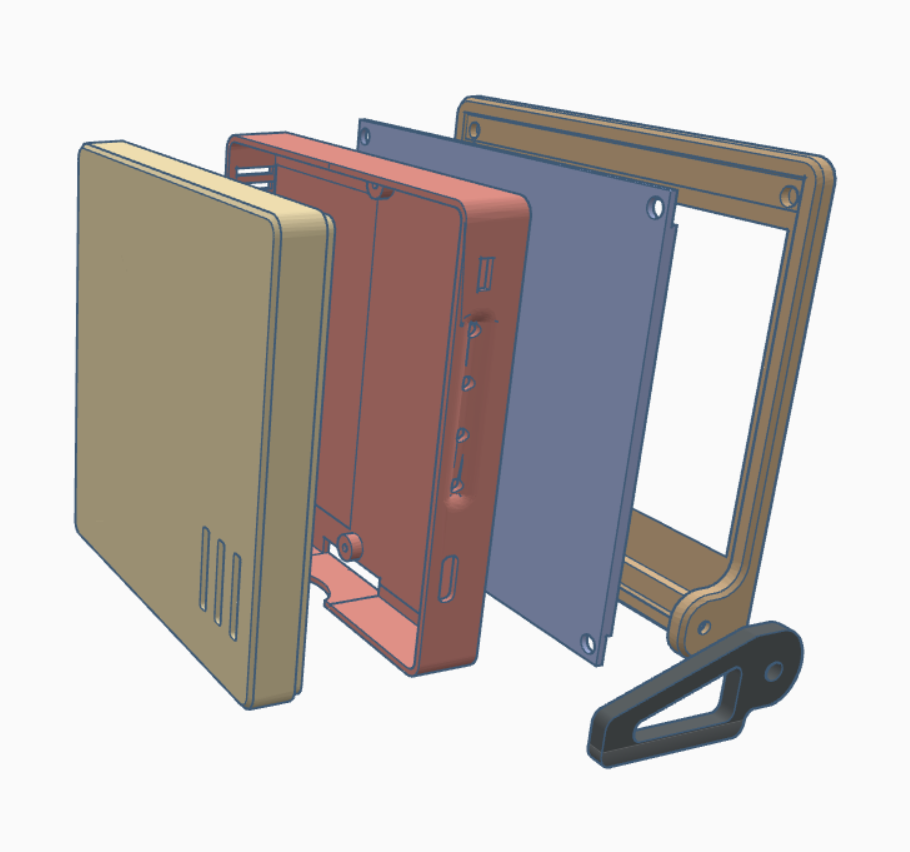
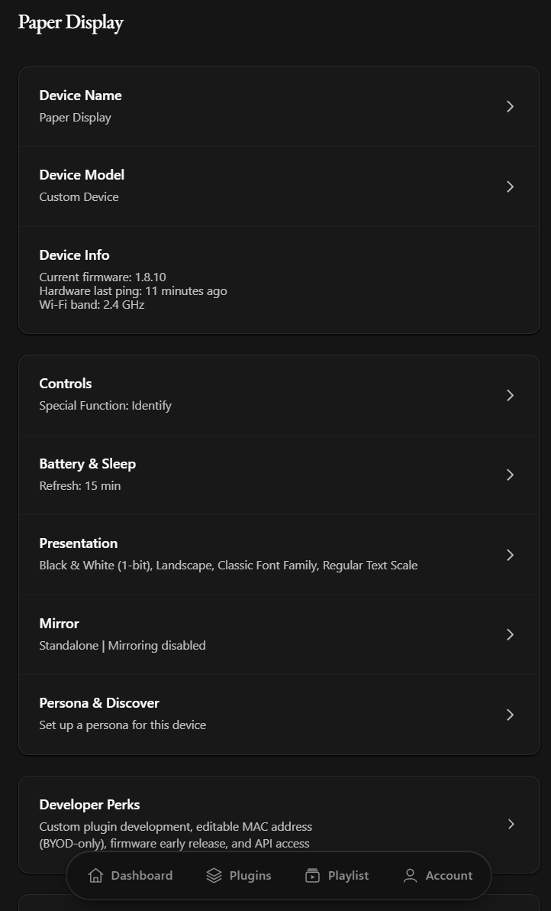
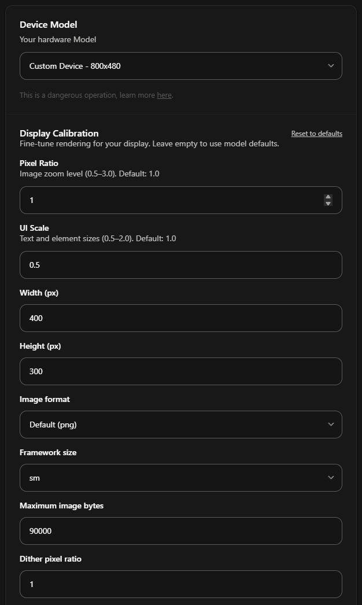
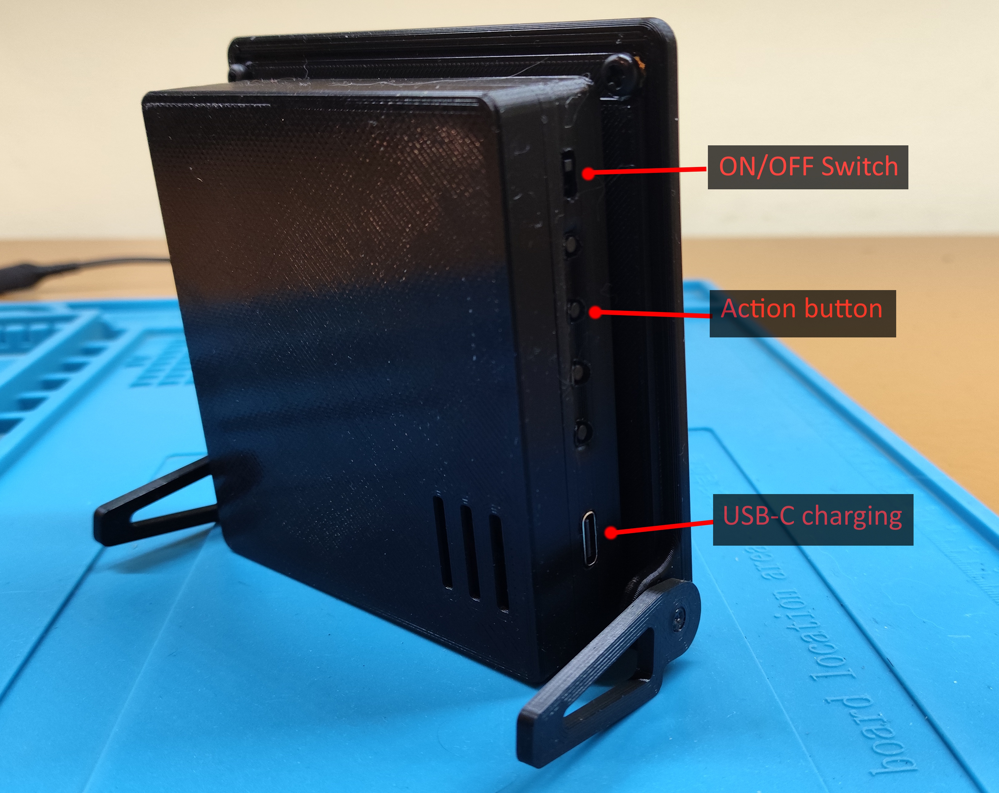

# Ink Desk

Ink Desk is a DIY, battery-powered 4.2-inch e-paper dashboard built with a Seeed Studio XIAO ESP32-S3 Plus, an EE04 display board, and the open-source TRMNL firmware. It can show calendars, weather, reminders, sensor data, and other glanceable information while consuming power mainly when the screen refreshes.

> [!IMPORTANT]
> This guide uses TRMNL's hosted service. It requires a paid [Bring Your Own Device (BYOD) license](https://shop.trmnl.com/products/byod), currently **USD 50 as a one-time fee for one device**. Check the current price before starting. A self-hosted [BYOS implementation](https://docs.trmnl.com/go/diy/byos) can be used without a BYOD license, but server setup is outside the scope of this guide.

<table>
  <tr>
    <td></td>
    <td></td>
  </tr>
  <tr>
    <td></td>
    <td></td>
  </tr>
</table>

## Contents

- [Repository structure](#repository-structure)
- [Hardware and tools](#hardware-and-tools)
- [Print the enclosure](#print-the-enclosure)
- [Assemble the device](#assemble-the-device)
- [Install the firmware](#install-the-firmware)
- [Configure TRMNL](#configure-trmnl)
- [Use the controls](#use-the-controls)
- [Create an updated custom firmware](#create-an-updated-custom-firmware-advanced)
- [License and sources](#license-and-sources)

## Repository structure

```text
ink-desk/
|-- firmware/
|   `-- trmnl-firmware_v1.8.10.zip  # Ready-to-build custom firmware
|-- media/                           # Build photos and configuration screenshots
|-- stl/                             # Printable enclosure models
|-- LICENSE
`-- README.md
```

The firmware ZIP contains a complete PlatformIO project. Extract it into its own folder before opening it in VS Code. PlatformIO may regenerate the local `.pio/` build directory.

## Hardware and tools

The main electronics are shown below. The EE04 kit includes the XIAO ESP32-S3 Plus, Wi-Fi antenna, 24-pin and 50-pin adapter boards, and their extension cables. This project uses only the 24-pin adapter and cable.

<p align="center">
  
</p>

### Bill of materials

| Item | Quantity | Notes |
|---|---:|---|
| [XIAO ePaper Display Board (ESP32-S3) - EE04](https://wiki.seeedstudio.com/epaper_ee04/) | 1 | Seeed Studio SKU `100075670`; includes the XIAO ESP32-S3 Plus, Wi-Fi antenna, adapters, and FFC cables |
| [4.2-inch monochrome e-paper display](https://www.seeedstudio.com/4-2-Monochrome-ePaper-Display-with-400x300-Pixels-p-5784.html) | 1 | Seeed Studio SKU `104990857`; 400 x 300 pixels, 24-pin FPC, black and white |
| 3.7 V Li-Po battery | 1 | 2500 mAh, JST 2.0 connector, approximately 55 x 76 x 5 mm |
| 24-pin FPC adapter and 24-pin FFC extension | 1 each | Included with the EE04; the 50-pin parts are not used |
| M3 screws | 6 | Used for the screen frame and feet |
| M2 screws | 4 | Used to secure the EE04 board |
| M3 brass threaded inserts | 6 | Heat-set into the front frame and feet |
| Double-sided tape | As needed | Secures the battery, antenna, and electronics housing |
| Black PLA filament | About 100 g | Other rigid filaments may work, but tolerances can vary |
| USB-C data cable | 1 | A charge-only cable cannot flash the board |

Optional materials:

- Thin EVA foam or foam rubber if the screen is loose inside its frame.
- Cyanoacrylate glue or black electrical tape if the electronics cover does not stay clipped in place.

Tools:

- 3D printer and slicer.
- Soldering iron for installing heat-set inserts.
- M2 and M3 screwdrivers or hex keys, matching the selected screws.
- A small non-metallic pointed object for pressing the XIAO boot button.

> [!CAUTION]
> Li-Po batteries can be damaged by reversed polarity, punctures, heat, or short circuits. Verify that the red wire reaches `+` and the black wire reaches `-` before connecting the battery. If the JST plug is wired incorrectly, disconnect the battery completely before carefully depinning and correcting the connector.

## Print the enclosure

The `stl/` directory contains five models but the completed enclosure needs six printed parts because the foot is printed twice.

| File | Suggested part name | Quantity |
|---|---|---:|
| [`screen-front.stl`](stl/screen-front.stl) | Front display frame | 1 |
| [`screen-back.stl`](stl/screen-back.stl) | Rear display plate | 1 |
| [`case-microcontroller.stl`](stl/case-microcontroller.stl) | Electronics housing | 1 |
| [`case-battery-cover.stl`](stl/case-battery-cover.stl) | Battery cover | 1 |
| [`foot.stl`](stl/foot.stl) | Support foot | 2 |

The pictured enclosure was printed on an Ender 3 V2 using black PLA, a 0.2 mm layer height, and no supports. Check the slicer preview before printing and keep the parts in their intended flat orientation.

<p align="center">
  
</p>

The STL files were adapted from this [source](https://www.hackster.io/Gokux/smart-wi-fi-epaper-scoreboard-5989b9), all credits to the original author. 

## Assemble the device

Read the complete sequence before connecting the battery or applying power.

1. **Install the threaded inserts.** Heat the soldering iron, place an M3 insert over each matching hole in the front display frame and both feet, and press it straight into the plastic until it sits flush. Do not touch the hot insert or leave the iron against the PLA longer than necessary.

   <p align="center">
     
   </p>

2. **Mount the display.** Remove the display's protective film, place the panel face-down in the front frame, fit the rear display plate, and secure it with the M3 screws. Do not overtighten. If the panel can move, add a thin layer of EVA foam or foam rubber between the rear of the screen and the plate.

3. **Extend the display cable.** Attach the 24-pin adapter to the screen's FPC and connect the supplied 24-pin FFC extension. The exposed contacts must face the connector contacts at both ends. Keep the cable straight and avoid sharp bends; a damaged FPC usually means replacing the display.

4. **Mount the controller.** Place the EE04 board in the electronics housing and secure it with four M2 screws. Connect the Wi-Fi antenna to the XIAO ESP32-S3, remove the antenna's adhesive backing, and stick it inside the housing. Confirm that the EE04 jumper is set to **24 Pin** before powering the board.

   <p align="center">
     
   </p>

5. **Connect the display and battery.** Insert the FFC extension into the EE04's 24-pin connector and lock the latch. Attach the battery to the battery cover with double-sided tape. Verify JST polarity, then connect it to the EE04 battery socket.

6. **Attach the feet.** Fasten both printed feet using the remaining M3 screws.

7. **Join the housings.** Use double-sided tape to attach the electronics housing to the rear display plate. Make sure the USB-C port, buttons, and power switch remain accessible.

   <p align="center">
     
   </p>

8. **Close the electronics case.** Clip the battery cover onto the electronics housing. If the fit is loose, use a small amount of cyanoacrylate glue or black electrical tape without blocking the vents or controls.

The physical assembly is now complete.

## Install the firmware

The 4.2-inch EE04 combination is not an officially selectable TRMNL target, so the standard web flasher cannot be used for this project. The provided archive contains the official firmware adapted for the 400 x 300 panel. The process follows Seeed Studio's official [Build and Flash from Source](https://wiki.seeedstudio.com/reterminal_e10xx_trmnl/#method-3-build-and-flash-from-source-advanced) workflow.

### 1. Install the development tools

1. Download and install [Visual Studio Code](https://code.visualstudio.com/docs/getstarted/overview).
2. Open VS Code.
3. Open the **Extensions** view with `Ctrl+Shift+X` or the Extensions icon.
4. Search for **PlatformIO IDE** and install the official extension.
5. Allow PlatformIO to finish its initial setup and restart VS Code if requested. PlatformIO IDE already includes the `pio` command; a separate PlatformIO Core installation is not required. See the official [PlatformIO IDE installation guide](https://docs.platformio.org/en/latest/integration/ide/vscode.html) for platform-specific requirements.

### 2. Open and build the provided firmware

1. Extract [`firmware/trmnl-firmware_v1.8.10.zip`](firmware/trmnl-firmware_v1.8.10.zip) into a new folder named, for example, `trmnl-firmware_v1.8.10`.
2. In VS Code, select **File -> Open Folder** and open the extracted folder that directly contains `platformio.ini`.
3. In the PlatformIO sidebar, open **Miscellaneous -> New Terminal**.
4. Build the custom environment:

   ```sh
   pio run -e TRMNL_EE04_4inch2
   ```

The command should finish with output similar to:

```text
Environment            Status
TRMNL_EE04_4inch2      SUCCESS
```

The first build can take several minutes while PlatformIO installs toolchains and libraries.

### 3. Find the serial port

Connect the EE04 to the computer with the USB-C data cable, then run:

```sh
pio device list
```

On Windows the port may be `COM3`, `COM4`, or another `COM` number. Linux and macOS use names such as `/dev/ttyACM0` or `/dev/cu.usbmodem...`. Use the port shown on your computer in every following command.

If the board is not listed, enter its bootloader mode:

1. Disconnect the USB-C cable.
2. Press and hold the small **B** boot button next to the XIAO's USB-C connector.
3. Reconnect USB-C while continuing to hold the button.
4. Wait two seconds, release the button, and run `pio device list` again.

### 4. Upload the firmware and record the MAC address

Replace `COM3` with the detected port and run:

```sh
pio run -e TRMNL_EE04_4inch2 -t upload --upload-port COM3
```

A successful upload ends with `SUCCESS`. During the connection stage, find and record the board's MAC address:

```text
Serial port COM3
Connecting...
Chip is ESP32-S3
MAC: e0:72:a1:xx:xx:xx
```

The MAC address is the six hexadecimal pairs after `MAC:`. It uniquely identifies this board and will be required when registering the device with TRMNL.

After the upload succeeds, leave the board connected, wait about two minutes, and press the physical **RESET** button once.

## Configure TRMNL

### 1. Connect the device to Wi-Fi

On its first boot, the firmware has no network credentials and starts a captive portal.

1. On a phone or computer, open the list of available Wi-Fi networks.
2. Connect to the temporary network named `TRMNL`.
3. The setup portal should open automatically. If it does not, visit `http://4.3.2.1` in a browser.
4. Select a **2.4 GHz** Wi-Fi network, enter its password, and choose **Connect** or **Save**. ESP32-S3 devices do not support 5 GHz Wi-Fi.
5. Reconnect the phone or computer to its usual network.

The Ink Desk will restart and contact TRMNL. If it remains on the startup screen for more than ten minutes, press RESET once.

### 2. Create an account and claim a BYOD device

1. Create an account or sign in at [TRMNL](https://usetrmnl.com/).
2. Purchase a [BYOD license](https://shop.trmnl.com/products/byod) and keep the order number from the confirmation email.
3. Open [Claim a Device](https://trmnl.com/claim-a-device), enter the order number and the requested purchaser information, and associate the license with the TRMNL account.
4. Open **Devices**, select the new BYOD device, and go to **Settings -> Developer Perks**.
5. Enter the ESP32-S3 MAC address in the **MAC Address** field using colon-separated pairs, then save.

Do not enter the Friendly ID, API key, or serial-port name in the MAC field. In the current flow, claiming the license creates the device and its six-character Friendly ID automatically; it does not need to be added a second time. See TRMNL's official [BYOD guide](https://docs.trmnl.com/go/diy/byod) for the current account workflow.

Press RESET once and allow one or two minutes for the first communication. In **Devices -> Settings**, `Hardware last ping` should change from `Never` to a recent time. The device reports firmware `1.8.10`.

<p align="center">
  
</p>

### 3. Configure the 400 x 300 display

The 4.2-inch panel is not a predefined model in TRMNL:

1. Open **Devices -> your device -> Settings -> Device Model**.
2. Select **Custom Device**. The label may retain default dimensions, but the calibration values below determine the rendered image.
3. Enter the following values and save:

| Setting | Value |
|---|---:|
| Pixel Ratio | `1` |
| UI Scale | `0.5` |
| Width | `400` |
| Height | `300` |
| Image format | `PNG` or `Default (png)` |
| Framework size | `sm` |
| Maximum Image Bytes | `90000` |
| Dither pixel ratio | `1` |

<p align="center">
  
</p>

The compact `sm` framework and `0.5` UI scale suit the small screen, but individual third-party plugins may still need layout adjustments.

Under **Settings -> Presentation**, select:

- **Black & White (1-bit)**.
- **Landscape** orientation.
- **Classic Font Family**.
- **Large (or X-Large) Text Scale**.

### 4. Protect the custom firmware

This EE04 adaptation is not an official TRMNL target. An automatic firmware update intended for different hardware could make the display unusable.

1. Open **Settings -> Developer Perks**.
2. Disable **Firmware Early Release**.
3. Disable **OTA Updates Enabled** or any equivalent automatic firmware-update option shown by the current interface.

### 5. Add content and configure refreshes

TRMNL plugins generate the screens requested by the Ink Desk. For a simple first setup:

1. Open **Plugins** and configure a calendar provider.
2. Select the calendars, local time zone, and number of days to show, then save.
3. Add a weather plugin, select a location, and choose the preferred units, such as Celsius, km/h, and mm.
4. Open **Playlist**, make sure both plugin instances are enabled, and arrange them in the desired order.
5. Open **Devices -> Settings -> Battery & Sleep** and set **Refresh** to `15 min`.

At each scheduled refresh, the device wakes, connects to Wi-Fi, requests the next eligible playlist screen, updates the e-paper panel, and returns to sleep. A longer interval reduces network activity and battery use.

> [!NOTE]
> This custom target reports a simulated battery voltage. Battery percentage and charging information shown in TRMNL should not be treated as an accurate measurement of the installed Li-Po battery.

## Use the controls

The enclosure exposes the battery power switch, the **Action** button connected to EE04 `KEY3`/GPIO5, and the USB-C port.

<p align="center">
  
</p>

With the included firmware:

| Input | Action |
|---|---|
| Short Action-button press | Immediately requests the next eligible playlist screen |
| Double click | Runs the special function selected under **Settings -> Controls** |
| Hold for about 1-5 seconds | Also runs the configured special function |
| Hold for more than 5 seconds | Clears Wi-Fi credentials and returns to provisioning mode |
| Hold for about 15 seconds | Performs a logical reset |
| RESET button | Restarts the ESP32-S3; it does not advance the playlist |

`KEY1` and `KEY2` are not used by this adaptation. A practical initial choice for the configurable special function is **Identify**.

At this point the build is complete. A working installation should show a recent hardware ping in TRMNL, report firmware `1.8.10`, render a full 400 x 300 monochrome screen, refresh on schedule, and advance the playlist when the Action button is pressed.

## Create an updated custom firmware (advanced)

The bundled firmware is the recommended and tested route. Advanced users can reproduce the EE04 adaptation on a newer revision of the official firmware. Upstream code can change, so match each change by purpose if the surrounding lines no longer look exactly like the examples below.

<details>
<summary>Show the complete firmware adaptation</summary>

### 1. Create a branch from the official firmware

Clone or update the [official TRMNL firmware repository](https://github.com/usetrmnl/trmnl-firmware), then create a working branch:

```sh
git switch main
git pull --ff-only
git switch -c ee04-4in2
```

The new variant uses the macro `BOARD_XIAO_EPAPER_DISPLAY_42` and leaves all official targets intact.

### 2. Set the 400 x 300 image size

In `include/config.h`, replace the default BMP-size definitions with:

```cpp
#if defined(BOARD_XIAO_EPAPER_DISPLAY_42)
#define DISPLAY_BMP_IMAGE_SIZE 15062 // 62-byte BMP header + 400*300/8 bytes
#define DEFAULT_IMAGE_SIZE     15000 // 400*300/8 bytes
#else
#define DISPLAY_BMP_IMAGE_SIZE 48062 // 62-byte BMP header + 800*480/8 bytes
#define DEFAULT_IMAGE_SIZE     48000
#endif
```

This allocates 15,000 bytes for a one-bit 400 x 300 image plus the 62-byte BMP header.

### 3. Add the board configuration

In the board-selection chain in `include/config.h`, add this block before the existing `BOARD_XIAO_EPAPER_DISPLAY` condition:

```cpp
#elif defined(BOARD_XIAO_EPAPER_DISPLAY_42)
#define DEVICE_MODEL      "seeed_esp32s3"
#define PIN_INTERRUPT     5 // KEY3 on the EE04
#define PIN_VBAT_SWITCH   6
#define VBAT_SWITCH_LEVEL HIGH
#define FAKE_BATTERY_VOLTAGE
```

This selects KEY3/GPIO5 as the wake/action button and GPIO6 as the active-high battery-measurement switch. Battery voltage remains simulated.

### 4. Add the battery input

Include the new macro in the battery-pin condition in `include/config.h`:

```cpp
#if defined(BOARD_XIAO_EPAPER_DISPLAY_42) || defined(BOARD_XIAO_EPAPER_DISPLAY) || \
  defined(BOARD_SEEED_RETERMINAL_E1001) || defined(BOARD_SEEED_RETERMINAL_E1002) || \
  defined(BOARD_SEEED_RETERMINAL_E1003)
#define PIN_BATTERY 1
```

Keep the rest of the upstream `#elif`/`#else` chain unchanged.

### 5. Add the PlatformIO environment

In `platformio.ini`, add the following environment before the existing `TRMNL_4inch26_DIY_Kit` environment:

```ini
[env:TRMNL_EE04_4inch2]
extends = env:esp32_base
board = seeed_xiao_esp32s3
framework = arduino
extra_scripts =
	pre:scripts/extra/git_version.py
	post:scripts/extra/post_build_seeed.py
build_flags =
	${env:esp32_base.build_flags}
	-D BOARD_XIAO_EPAPER_DISPLAY_42
	-D PNG_MAX_BUFFERED_PIXELS=6432
	-D USE_FAKE_BATTERY_VOLTAGE
```

### 6. Reuse the EE04 pinout

In `src/DEV_Config.h`, extend the EE04 condition so the new macro uses the same SPI and control pins:

```cpp
#elif defined(BOARD_XIAO_EPAPER_DISPLAY_42) || defined(BOARD_XIAO_EPAPER_DISPLAY) || \
  defined(BOARD_XIAO_EPAPER_DISPLAY_3CLR)
   // Pin definition for XIAO ePaper Display Board EE04
#define EPD_SCK_PIN  7
#define EPD_MOSI_PIN 9
#define EPD_CS_PIN   44
#define EPD_RST_PIN  38
#define EPD_DC_PIN   10
#define EPD_BUSY_PIN 4
```

### 7. Select the 4.2-inch panel

In the `dpList` declaration in `src/display.cpp`, add this case before the existing `MINI_EPD` case:

```cpp
#ifdef BOARD_XIAO_EPAPER_DISPLAY_42
    {EP42B_400x300, EP42B_400x300}, // default: 042BN-T81-D2 / GDEY042T81 family
    {EP42B_400x300, EP42B_400x300}, // a: monochrome until grayscale is validated
    {EP42B_400x300, EP42B_400x300}, // b: monochrome until grayscale is validated
};
BBEPAPER bbep(EP42B_400x300);
#elif defined(MINI_EPD)
```

Do not remove the content that already follows the upstream `MINI_EPD` condition. All three profiles deliberately use monochrome mode because grayscale has not been validated for this panel.

### 8. Review and compile

Review the changes:

```sh
git diff --check
git diff -- include/config.h platformio.ini src/DEV_Config.h src/display.cpp
```

Build the custom target:

```sh
pio run -e TRMNL_EE04_4inch2
```

Also build an unchanged official target to check that the shared conditionals still work:

```sh
pio run -e TRMNL_4inch26_DIY_Kit
```

The custom result should target the XIAO ESP32-S3, use the EE04 pinout, select the monochrome `EP42B_400x300` panel, assign KEY3/GPIO5, and use image sizes of 15,000 and 15,062 bytes.

</details>

## License and sources

This repository is distributed under the [GNU General Public License v3.0](LICENSE).

The firmware procedure and adaptation are based on:

- [TRMNL firmware](https://github.com/usetrmnl/trmnl-firmware)
- [TRMNL Flash Assistant](https://trmnl.com/flash)
- [TRMNL BYOD documentation](https://docs.trmnl.com/go/diy/byod)
- [Seeed Studio: Work with TRMNL](https://wiki.seeedstudio.com/reterminal_e10xx_trmnl/)
- [Seeed Studio: Getting Started with EE04](https://wiki.seeedstudio.com/epaper_ee04/)

TRMNL and Seeed Studio product names and trademarks belong to their respective owners.
